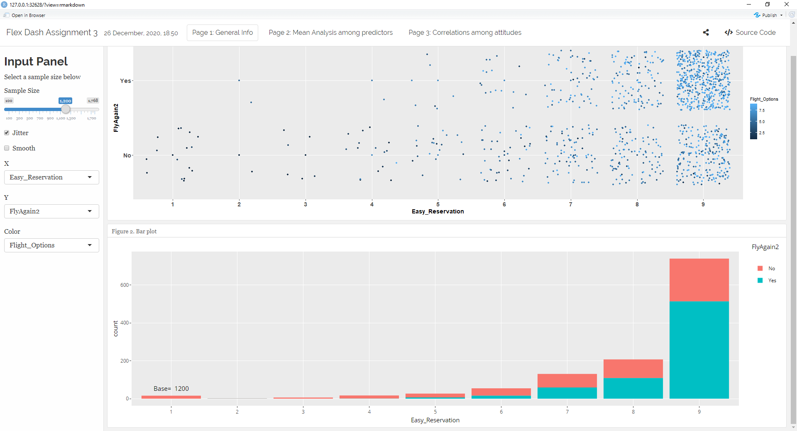
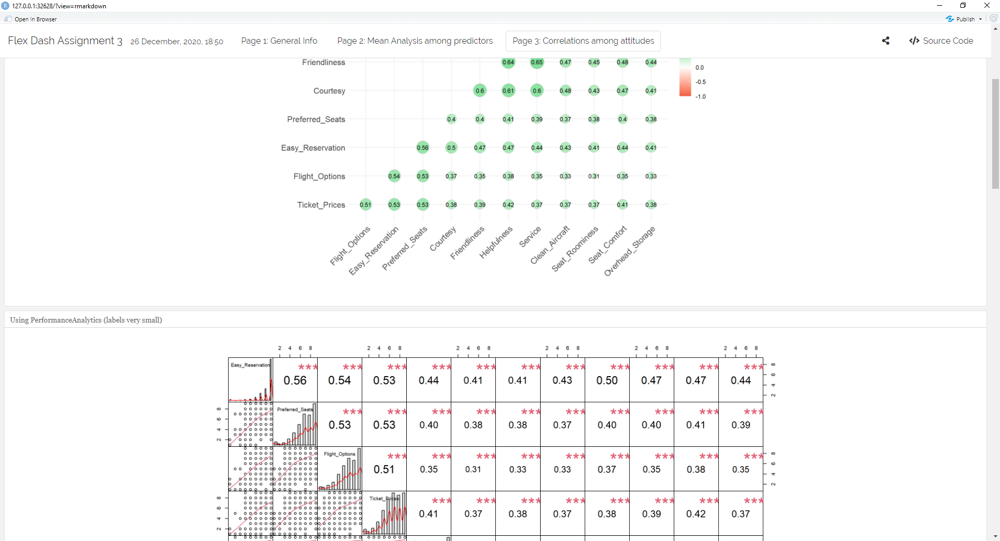
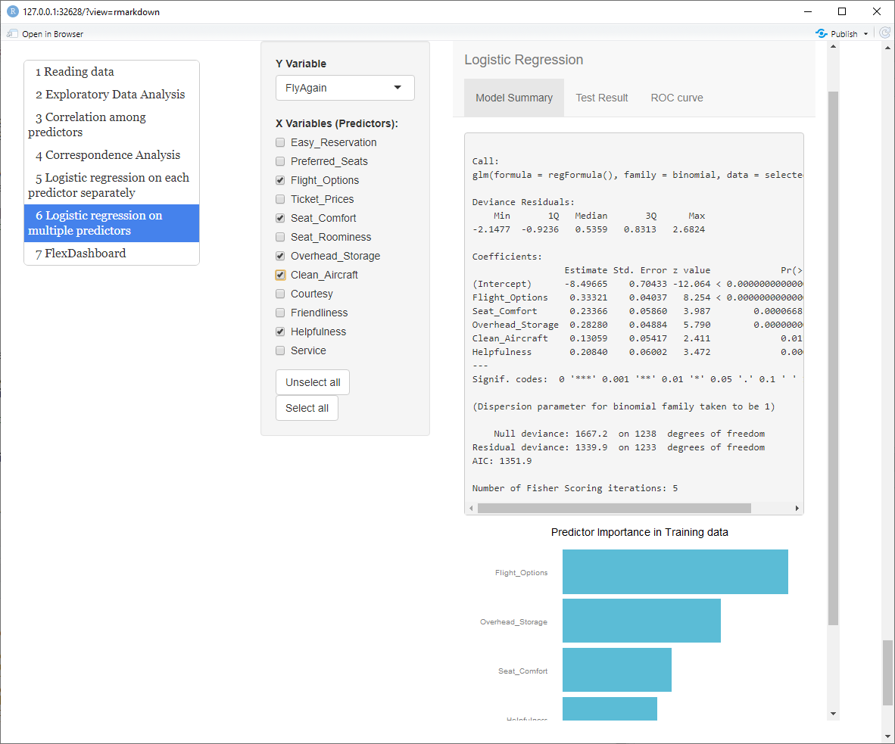

# dashboards-in-R

In this project I create executive-styled dashbaords and visualizations of the airline data that I worked with [here](../key-driveres-airline).

This was the first time that I worked with `shiny` `flexdb` in R.

As the compiled version of the dashboards could not be uploaded and can only be obtained by running the *.rmd* files in R studio (all source files are available!), I have some snapshots of them below.

